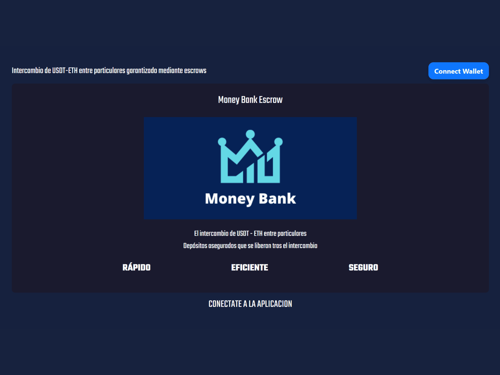
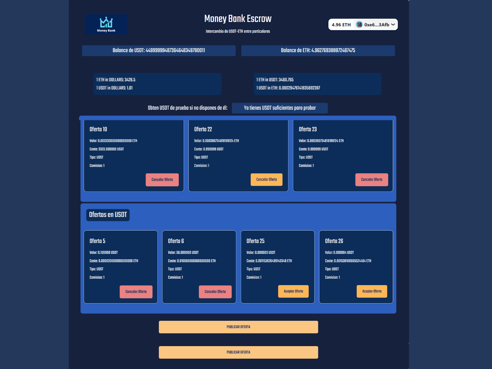
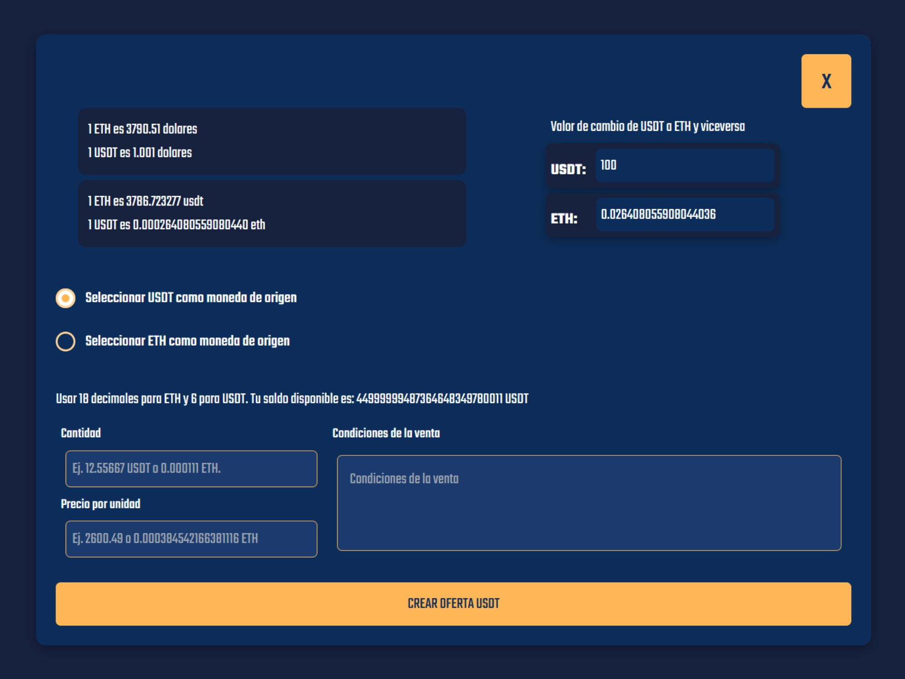

# Money Bank Escrow DApp 🏦💸



## Descripción Breve

Una Aplicación Descentralizada (DApp) P2P construida sobre la red de pruebas **Sepolia (Ethereum)** que permite a los usuarios intercambiar tokens ERC20 (específicamente USDT de prueba) de forma segura entre pares utilizando un sistema de **escrow** basado en smart contracts. El objetivo es eliminar intermediarios y riesgos de contraparte.

## Características Principales ✨

* **Creación de Ofertas Seguras:** Publicación de ofertas de intercambio bloqueando los fondos del ofertante en el contrato escrow hasta su aceptación o cancelación.
* **Intercambio Atómico y Sin Concurrencia:** Lógica que asegura el intercambio simultáneo de fondos en la misma transacción al aceptar una oferta, evitando inconsistencias.
* **Faucet de Tokens de Prueba:** Funcionalidad on-chain para obtener USDT de prueba directamente desde el contrato y facilitar el testeo en Sepolia. Solo estará disponible si el balance de la cuenta conectada es cercano a cero.
* **Seguridad Reforzada:**
    * **Firma de Transacciones:** Verificación mediante `signMessage` y nonces únicos para autorizar operaciones críticas.
    * **Patrones Seguros:** Aplicación del patrón Checks-Effects-Interactions en Solidity para mitigar riesgos comunes.

## Tecnologías Utilizadas 🛠️

* **Smart Contracts:** Solidity
* **Testing & Desarrollo Contratos:** Foundry 
* **Frontend:** React, TypeScript, HTML, CSS 
* **Librerías Web3 Frontend:** Wagmi, Viem, RainbowKit, Ethers.js 
* **Blockchain:** Ethereum (Sepolia Testnet)
* **Wallet:** Metamask (o compatible con RainbowKit)

## Demo en Vivo 🔗

Puedes probar la aplicación aquí (necesitarás Metamask configurado para Sepolia y algo de ETH Sepolia para el gas):
**[https://money-bank-escrow.vercel.app/](https://money-bank-escrow.vercel.app/)**

## Cómo Empezar (Desarrollo Local) 🚀

1.  **Prerrequisitos:**
    * Node.js
    * npm o yarn
    * Git
    * Foundry 
    * Wallet de navegador (Metamask).

2.  **Clonar Repositorio:**
    ```bash
    git clone https://github.com/Juan-Fuente-T/money_bank_escrow.git
    cd money_bank_escrow
    ```
3.  **Instalar Dependencias:**
    ```bash
    # Comando para instalar dependencias del frontend (ej. cd frontend && npm install)
    npm install # o yarn install
    # Comando para instalar dependencias de contratos si aplica (ej. cd ../contracts && forge install)
    cd ./foundry
    forge install 
    ```
4.  **Configurar Variables de Entorno:**
    * Crea un archivo `.env` en la raíz (o donde corresponda `[TU AYUDA AQUÍ: Indicar ubicación .env.local]`).
    * Añade la variable necesaria (`REACT_APP_PROJECT_ID`, para conexión de wallet). 
    * *Asegúrate de añadir `.env.local` al archivo `.gitignore`.*
5.  **Iniciar Frontend:**
    ```bash
    # Comando para iniciar el frontend (ej. cd ../frontend && npm run dev)
    npm run dev # o yarn dev
    ```
6.  Abrir `http://localhost:3000` (o el puerto indicado) en el navegador.

## Uso Básico 🖱️

1. Conecta tu wallet (Metamask) en la red Sepolia.
2. Usa el botón "Obtener Tokens de Prueba" si necesitas USDT. 
3. Crea una oferta especificando tokens y cantidades. Aprueba la transacción.
4. Explora las ofertas disponibles y acepta la que te interese si tienes fondos.
5. Cancela tus propias ofertas activas si lo deseas.





## Restos y aprendizajes 🧠
#### Escrows
- La dapp implementa un sistema de escrows, mediante el cual al crearse la oferta se está aprobando y enviando al contrato la cantidad ofertada, que se mantiene bloqueada hasta que es cancelada o aceptada por otro usuario.
#### Logica
- He creado una lógica para la evitar la concurrencia en las transacciones, ya que al aceptarse la oferta se envía la cantidad del intercambio al ofertante y se recibe el importe de la oferta en la misma transacción, evitando que se  pueda interactuar simultáneamente con la misma oferta, evitando inconsistencias o comportamientos no deseados.
#### Uso de Api externa
- Integra la API de CoinGecko para obtener valores actualizados de intercambio, para lograr que la información mostrada al usuario sea precisa y actualizada, mejorando la experiencia del usuario.
#### Rainbowkit
- Me he decantado por el uso de Wagmi y RainbowKit  para manejar la conexión con la wallet del  usuario,  para proporcionar una experiencia más fluida en la conexión/desconexión y con mayor flexibilidad al permitir conectarse con una amplia variedad de wallets.
#### Transferencia de tokens
- Para facilitar las pruebas y la experiencia de usuario, la aplicación incluye una funcionalidad que permite a los usuarios obtener tokens USDT de prueba directamente desde el contrato. Si no se posee balance de dicho token se muestra un botón en la interfaz que, al ser presionado, interactúa con el contrato para enviar 100 tokens a la wallet conectada del usuario. Esto permite probar las funcionalidades de la dApp si se dispone de ether nativo en la red Sepolia.
#### Firma de transacciones
- Se implementa un sistema de firma de transacciones para mejorar la seguridad y autenticidad. Utiliza la función signMessage para firmar un mensaje compuesto por los detalles críticos de la transacción y un nonce único. La firma resultante se verifica en el contrato inteligente antes de ejecutar la transacción, lo que garantiza que solo el propietario de la wallet pueda autorizar las operaciones y previene las manipulaciones.
#### Seguridad
- He prestado especial atención al diseño del contrato inteligente, usando siempre el patrón Checks-Effects-Interactions para evitar vulnerabilidades y problemas de concurrencia en las transacciones.
- Implementé lógica clara y robusta para gestionar estados en el escrow y asegurar transacciones seguras.

## Licencia 📄

Distribuido bajo la Licencia MIT. Ver `LICENSE` para más información. 

## Contacto 📬

Juan Fuente - https://www.linkedin.com/in/juan-fuente-dev/  -  https://juanfuente.ovh  -  jfuentet@gmail.com 
